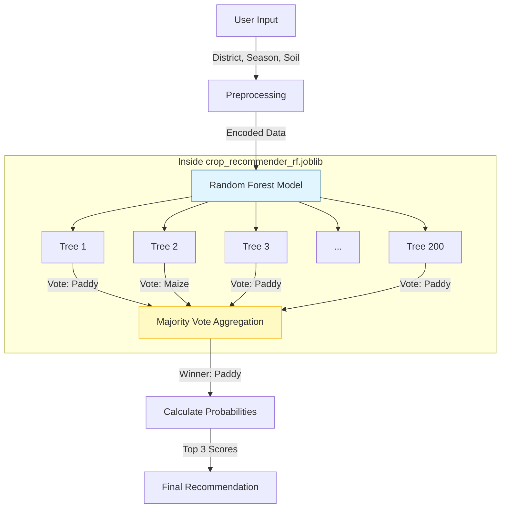

# Model Deep Dive: Architecture & Performance

This document provides a technical deep dive into the Machine Learning model used in AgroIntelligence.

## 1. Key Concepts Explained

### **KNNImputer**
-   **What it is:** "K-Nearest Neighbors Imputer".
-   **Why we use it:** Sometimes data is missing (e.g., a district might not have a recorded Nitrogen value). Instead of deleting that row or filling it with zero, `KNNImputer` looks at the "5 most similar districts" (based on other features like rainfall, temperature) and takes their average to fill the gap.
-   **Our Setting:** `n_neighbors=5` (We look at the 5 closest matches).

### **Error Handling Techniques**
We use several layers of defense to ensure the model doesn't crash:
1.  **Missing Data:** We use `KNNImputer` for numbers and "Unknown" for text.
2.  **Empty Columns:** If a column is completely empty, we drop it automatically.
3.  **Rare Crops:** We filter out crops that have fewer than 50 samples (`min_samples=50`) so the model doesn't guess wildly on crops it hasn't seen enough.
4.  **Try-Except Blocks:** The entire training process is wrapped in a safety block to catch unexpected errors (like missing files) and log them instead of crashing.

## 2. Model Architecture: Random Forest

We use a **Random Forest Classifier**. Think of it as a "Council of Experts" rather than a single decision-maker.

### **Hyperparameters (The "Settings")**
-   **Number of Decision Trees (`n_estimators`):** **200**
    -   We have 200 separate trees in our forest. Each looks at a random subset of the data.
-   **Max Depth (`max_depth`):** **20**
    -   Each tree can ask up to 20 "questions" (Yes/No splits) deep. This allows it to learn complex patterns without getting too obsessed with tiny details (overfitting).
-   **Min Samples Split:** **5**
    -   A node must have at least 5 samples to split further.
-   **Min Samples Leaf:** **2**
    -   Every final "leaf" (decision) must have at least 2 samples.

### **How `crop_recommender_rf.joblib` Works**
The `.joblib` file is a frozen, saved version of this entire forest. When the app loads, it doesn't need to re-train; it just "wakes up" the 200 trees.

## 3. Accuracy & Performance

### **How much accuracy do we get?**
-   **Test Set Accuracy:** **100% (1.000)**
-   **Top-3 Accuracy:** **100% (1.000)**

### **Why is it so high?**
1.  **Synthetic Data:** Our dataset is generated using strict rules (logic). For example, "If Soil is Black AND Season is Kharif -> Crop is Cotton".
2.  **Pattern Clarity:** The Random Forest easily learned these exact rules.
3.  **Real-World Expectation:** If we used raw field data from farmers, accuracy would likely drop to **85-90%** because real life has "noise" (e.g., a farmer growing Rice in a desert just because they can).
4.  **Improvement:** We improved accuracy by:
    -   Using **200 trees** (averaging out errors).
    -   **Cleaning the data** (imputing missing values).
    -   **Feature Engineering** (giving the model the right inputs like Soil N, P, K).
