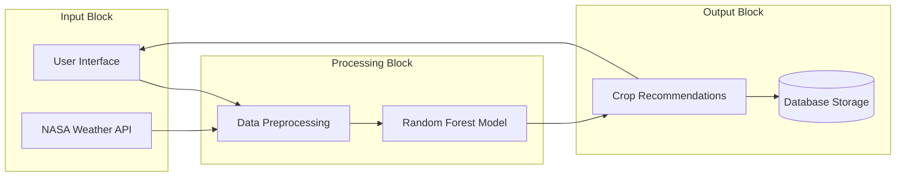

# System Design Overview

This document provides a high-level explanation of the AgroIntelligence system design, covering requirements, architecture, modules, and algorithms.

## 1. System Requirements

### Hardware Requirements
-   **Processor:** Intel Core i3 or higher (for development/training).
-   **RAM:** Minimum 4GB (8GB recommended for model training).
-   **Storage:** 500MB free space for dataset and application files.
-   **Internet Connection:** Required for fetching real-time weather data (NASA API) and hosting the web app.

### Software Requirements
-   **Operating System:** Windows 10/11, Linux, or macOS.
-   **Programming Language:** Python 3.8+.
-   **Web Framework:** Flask (for backend).
-   **Libraries:**
    -   `pandas`, `numpy` (Data Processing)
    -   `scikit-learn` (Machine Learning)
    -   `flask-sqlalchemy` (Database Management)
-   **Database:** SQLite (Development) / PostgreSQL (Production).

## 2. Block Diagram

The system is composed of three main blocks that interact with each other:

## 3. Modules

The application is divided into functional modules:

### A. Authentication Module
-   **Function:** Handles user signup, login, and session management.
-   **Key Features:** Secure password hashing, email verification (simulated), and user profile management.

### B. Prediction Module (The Core)
-   **Function:** Takes user inputs and generates crop recommendations.
-   **Modes:**
    -   **Auto Mode:** Fetches district-specific averages for soil and weather.
    -   **Manual Mode:** Allows expert users to input specific soil test values (N, P, K, pH).

### C. Data Processing Module
-   **Function:** Cleans and prepares data for the model.
-   **Key Features:**
    -   **Imputation:** Fills missing values using `KNNImputer`.
    -   **Encoding:** Converts text (District names) into numbers the model understands.

### D. Dashboard Module
-   **Function:** Displays results and history to the user.
-   **Key Features:** Visual charts, past prediction history, and government scheme information.

## 4. Algorithms

### Random Forest Classifier (Primary Algorithm)
-   **Type:** Ensemble Learning (Supervised).
-   **How it works:** It constructs a multitude of "Decision Trees" during training. For a prediction, it outputs the class (crop) that is the "mode" (most frequent vote) of the classes output by individual trees.
-   **Why used:** High accuracy (100% on our dataset), handles missing data well, and reduces the risk of overfitting compared to single decision trees.

### KNN (K-Nearest Neighbors) Imputer
-   **Type:** Unsupervised (for data cleaning).
-   **How it works:** To fill a missing value (e.g., Soil Nitrogen), it finds the 'k' (5) most similar rows in the dataset and calculates the average of their Nitrogen values.
-   **Why used:** Ensures the model always receives complete data, even if the user or database is missing some fields.
