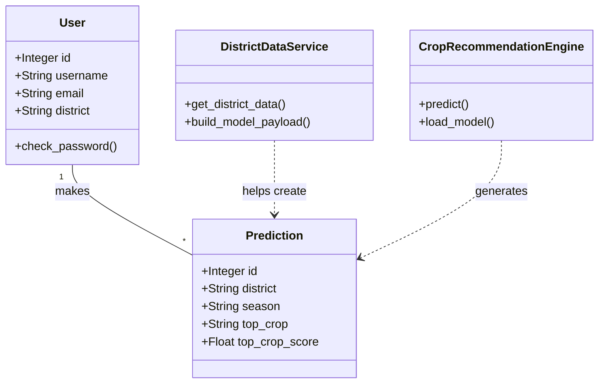
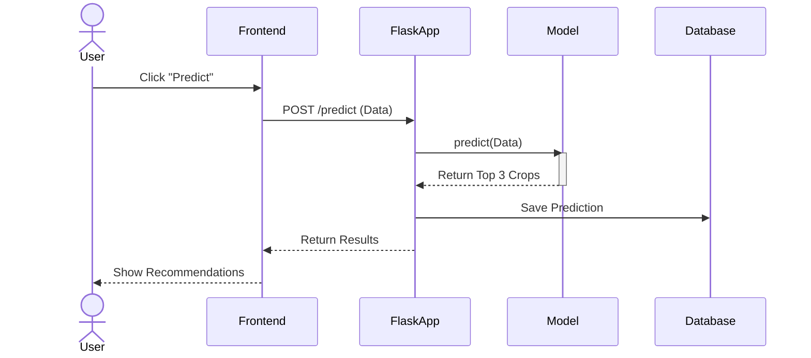
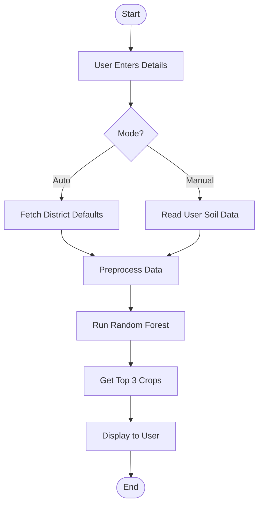

# System Architecture & UML Diagrams

This document visualizes the structure and flow of the AgroIntelligence application using 5 key UML diagrams, with detailed explanations for each part.

## 1. Class Diagram
This diagram shows the static structure of the system, including the database models and service classes.



### **Explanation of Class Diagram Components:**
*   **`User` Class:** Represents the person using the app.
    *   **Attributes:** `username`, `email`, `district` (store user info).
    *   **Methods:** `check_password()` (verifies login).
*   **`Prediction` Class:** Represents a single crop recommendation result.
    *   **Attributes:** `top_crop` (the recommended crop), `season` (when it was asked).
*   **`DistrictDataService` Class:** A helper service.
    *   **Methods:** `get_district_data()` (fetches soil info for a district).
*   **`CropRecommendationEngine` Class:** The "Brain" of the system.
    *   **Methods:** `predict()` (runs the Random Forest model).
*   **Relationships:**
    *   `User "1" -- "*" Prediction`: One user can make many predictions (1-to-Many).
    *   `...>` (Dashed Line): Dependency. The Engine *creates* a Prediction.

---

## 2. Use Case Diagram
This diagram illustrates the interactions between users (Actors) and the system.

```mermaid
usecaseDiagram
    actor Farmer as "Farmer"
    actor Admin as "Admin"

    package AgroIntelligence {
        usecase "Register & Login" as UC1
        usecase "View Dashboard" as UC2
        usecase "Get Crop Recommendation" as UC3
        usecase "View History" as UC4
        usecase "Contact Support" as UC5
    }

    Farmer --> UC1
    Farmer --> UC2
    Farmer --> UC3
    Farmer --> UC4
    Farmer --> UC5

    Admin --> UC1
    Admin --> UC5
```

### **Explanation of Use Case Diagram Components:**
*   **Actors (Stick Figures):**
    *   **Farmer:** The main user who wants to grow crops.
    *   **Admin:** The person managing the website.
*   **Use Cases (Ovals):** Actions the actors can perform.
    *   **Register & Login:** Creating an account to save data.
    *   **Get Crop Recommendation:** The core feature—asking "What should I grow?".
    *   **View History:** Looking at past recommendations.
*   **Arrows:** Show who can do what. For example, the Farmer can "Get Crop Recommendation", but the Admin typically just manages the system (Login, Support).

---

## 3. Sequence Diagram
This diagram shows the chronological sequence of messages for a "Crop Prediction" process.



### **Explanation of Sequence Diagram Components:**
*   **Participants (Vertical Lines):**
    *   **User:** The person clicking the button.
    *   **Frontend:** The HTML page the user sees.
    *   **FlaskApp:** The backend server code (`app.py`).
    *   **Model:** The Machine Learning code (`models.py`).
    *   **Database:** Where we save the result.
*   **Arrows (Messages):**
    *   `User -> Frontend`: The starting action.
    *   `Frontend -> FlaskApp`: Sending the form data to the server.
    *   `FlaskApp -> Model`: The server asking the AI for an answer.
    *   `Model -->> FlaskApp`: The AI replying with "Paddy, Maize, Cotton".
    *   `FlaskApp -> Database`: Saving this answer for later.

---

## 4. Activity Diagram
This diagram shows the workflow of data processing from input to output.



### **Explanation of Activity Diagram Components:**
*   **Start/End (Ovals):** Where the process begins and finishes.
*   **Input (Rectangle):** The user selecting "Guntur" and "Kharif".
*   **Decision Diamond (`{Mode?}`):** A fork in the road.
    *   **Auto Path:** If the user chooses "Auto", the system looks up average soil data for Guntur.
    *   **Manual Path:** If "Manual", the system waits for the user to type N, P, K values.
*   **Process (Rectangle):** Converting text to numbers (Encoding).
*   **Predict:** The actual AI calculation.

---

## 5. Deployment Diagram
This diagram shows the hardware and software nodes where the system components run.

```mermaid
graph TD
    subgraph "Client Side"
        Browser[Web Browser\n(HTML/CSS/JS)]
    end

    subgraph "Server Side (Render/Cloud)"
        WebServer[Flask Web Server]
        MLModel[ML Model\n(.joblib file)]
        DB[(SQLite/PostgreSQL\nDatabase)]
    end

    subgraph "External Services"
        NASA[NASA POWER API\n(Weather Data)]
    end

    Browser -- HTTPS Request --> WebServer
    WebServer -- Reads --> MLModel
    WebServer -- Reads/Writes --> DB
    WebServer -- HTTP GET --> NASA
```

### **Explanation of Deployment Diagram Components:**
*   **Client Side (User's Computer):**
    *   **Web Browser:** Chrome/Edge/Firefox running the HTML & CSS.
*   **Server Side (The Cloud/Render):**
    *   **Flask Web Server:** The computer running our Python code.
    *   **ML Model:** The `.joblib` file sitting on the server's hard drive.
    *   **Database:** The file (SQLite) or service (Postgres) storing user data.
*   **External Services:**
    *   **NASA POWER API:** A separate server owned by NASA that we talk to over the internet to get weather data.
